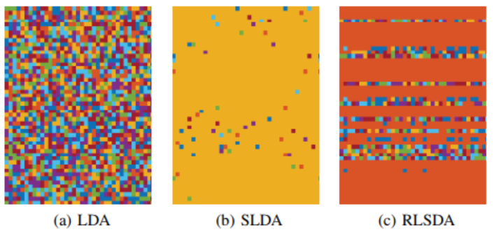
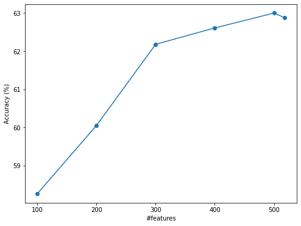

# Robust Sparse Linear Discriminant Analysis - RSLDA in Python

A Python implementation of RSLDA based on paper [Wen J, Fang X, Cui J, et al. Robust sparse linear discriminant analysis[J]. IEEE Transactions on Circuits and Systems for Video Technology, 2018. doi:10.1109/TCSVT.2018.2799214](https://ieeexplore.ieee.org/document/8272002)\
The original Matlab code of authors can be found at: https://github.com/ckghostwj/RSLDA

## Requirements
- Python 3
- Scikit-learn
- Scipy
- tqdm

## Main objectives
The RSLDA algorithm analyse features that effect directly on the result of classification problem. Following authors: "RSLDA can simultaneously select and extract the most discriminative features for classification". Therefore, RSLDA can be used for 2 main objectives: Features Selection and Features Extraction.\

#### 1. Features Selection
- Authors: "Feature selection aims to select a few of the most important or relevant features from the original features to efficiently represent original data for a given task. It does not change the feature value but allows
data to be better classified and more efficiently stored". 
#### 2. Features Extraction
- Authors: "Feature extraction tries to learn a projection matrix that can transform the original high dimensional data into a low dimensional subspace".

## Inferences
A simple inference was created to test the efficiency of RSLDA algorithm.\
I used the medium subset of [Music Analysis Data Set](https://github.com/mdeff/fma) with 19922 training examples, 2573 testing examples, 518 features, 16 classes. The benchmark of classification for this data can be found in paper [A Dataset For Music Analysis](https://arxiv.org/abs/1612.01840).\
To test the efficiency of RSLDA, I reduced number of features from 518 (Acc = 62.88% as paper) to 500, 400, 300, 200, 100 respectively and train classification model with the same method as paper. The code in [inference.ipynb](https://github.com/HoangPham3003/RSLDA-in-Python/blob/main/infer/code/inference.ipynb) can be downloaded and run for inferences. Results were described below:\

## References
Very thanks to:
1. [Wen J, Fang X, Cui J, et al. Robust sparse linear discriminant analysis[J]. IEEE Transactions on Circuits and Systems for Video Technology, 2018. doi:10.1109/TCSVT.2018.2799214](https://ieeexplore.ieee.org/document/8272002)
2. [A Dataset For Music Analysis by @Michaël Defferrard](https://github.com/mdeff/fma)

